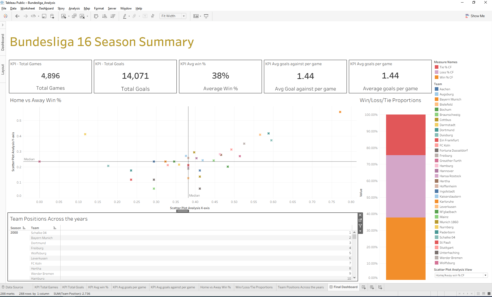

# Bundesliga Performance Analytics (Tableau Edition)

[](https://www.python.org/)
[](https://spark.apache.org/docs/latest/api/python/index.html)
[](https://public.tableau.com/)

> **🎯 Technology Agnosticism Showcase:** This repository contains a complete rebuild of the semantic and visual reporting layer using **Tableau**. It directly consumes the standardized data assets produced by my core PySpark data engineering pipeline, matching the look, logic, and KPIs of my original Power BI implementation. 
> 
> 🔗 **Core Data Pipeline & Power BI Repo:** [pyspark-football](https://github.com/Data-Analysis-Hub/pyspark-football)

---

## 🚀 Live Interactive Dashboard
The complete interactive workbook is published and available on Tableau Public. You can explore the filters, drill down into seasonal eras, and interact with the data models live:

👉 **[View the Live Interactive Dashboard on Tableau Public](https://public.tableau.com/app/profile/hamza.khiar/viz/Bundesliga_Analysis/FinalDashboard)**

---

## 📊 Tableau Dashboard Preview



---

## 📌 Project Overview
This project analyzes **16 seasons of historical German Bundesliga data (18 teams)** to uncover deep historical trends, seasonal team dynamics, and core performance metrics. 

By separating the heavy transformation processing (**PySpark**) from the consumption layer (**Tableau**), the architecture demonstrates clean, enterprise-grade decoupling. The metrics, filtering, and core visual structures are precisely mapped to showcase adaptive reporting capabilities across top-tier BI suites.

---

## 🏗️ Architecture & Decoupled Data Workflow

1. **Processing Layer:** Raw match data is ingested and wrangled using **PySpark** (Google Colab / Databricks) to handle historical volumes and compile complex season-over-season aggregations.
2. **Storage Optimization:** Optimized analytical files are exported using compressed, columnar **Parquet** formatting, partitioned by `Season`.
3. **Consumption Layer (Tableau):** Tableau connects natively to the partitioned Parquet outputs, optimizing query performance by reading only the necessary seasonal folders.

---

## 🔀 Mapping Logic: DAX to Tableau Calculations

To maintain complete metric integrity across platforms, complex Power BI DAX measures were fully translated into optimized Tableau Calculated Fields:

| Metric | Power BI DAX Expression | Tableau Calculated Field |
| :--- | :--- | :--- |
| **Total Games** | `DIVIDE(SUM(TotalGames), 2)` | `SUM([Total Games]) / 2` |
| **Home Win %** | `DIVIDE(SUM(TotalHomeWin), SUM(TotalHomeWin) + ...)` | `SUM([TotalHomeWin]) / (SUM([TotalHomeWin]) + SUM([TotalHomeTie]) + SUM([TotalHomeLoss]))` |
| **Home Goal Diff** | `SUM(HomeScoredGoals) - SUM(HomeAgainstGoals)` | `SUM([HomeScoredGoals]) - SUM([HomeAgainstGoals])` |

---

## 📈 Dashboard Key Visual Features
* **Executive Performance KPIs:** High-level cards tracking absolute numbers across 16 seasons including Total Games, Goals, and Average Metrics.
* **Team DNA Quadrant Analysis:** An advanced scatter plot charting Home Win % vs Away Win % with an explicitly calculated median reference boundary to classify team tactical profiles into quadrants.
* **Historical Position Tracker:** Detailed temporal matrices outlining precise final team positions parsed dynamically across seasonal cycles.

---

## 📁 Repository Structure
```
bundesliga-tableau/
│
├── visuals/
│   └── tableau_dashboard.png       # High-resolution dashboard capture
│
├── Bundesliga_Analysis.twbx        # Packaged Tableau Workbook file
└── README.md
```
---
*Developed as part of an advanced data analytics portfolio focusing on scalable, cross-platform BI architectures.